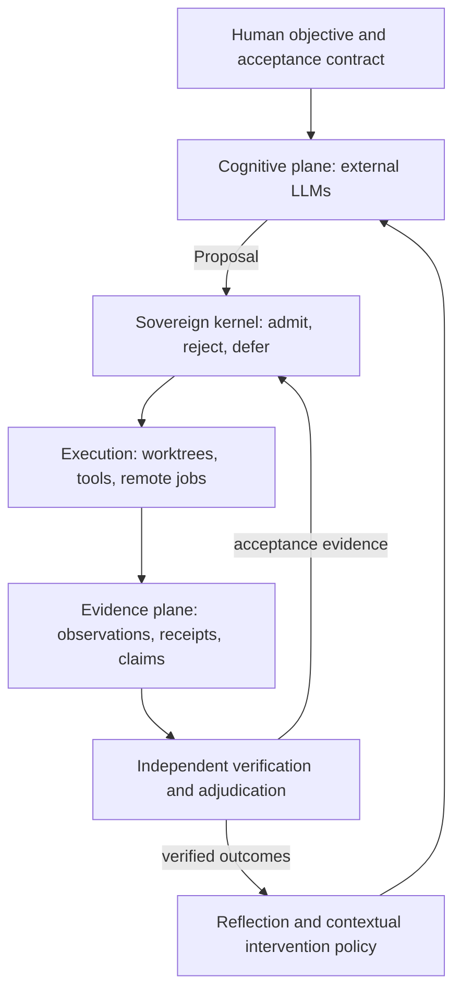

# Future-Code

[中文](README.zh.md)

Future-Code is a runtime for sustained software development and research using
external LLM APIs. Models propose plans, code, tools and hypotheses. The kernel
controls execution authority; independent checks determine acceptance.

**Models propose. Evidence decides. Future-Code enforces.**

## Architecture



| Boundary | Responsibility | Implementation |
|---|---|---|
| Cognition | Open-ended reasoning, decomposition, code and hypotheses | `src/harness/foundry/swarm/model.ts`, `recovery.ts` |
| Authority | Proposal admission, frozen contracts, DAG, scopes, budgets, leases and recovery | `src/harness/foundry/` |
| Evidence | Append-only observations, immutable artifacts, retractable claims, conflicts and independent adjudication | `store.ts`, `evidenceFabric.ts`, `claims.ts`, `adjudication.ts` |
| Learning | Host-measured reflection and contextual intervention recommendations | `rndReflection.ts`, `interventionMemory.ts`, `contextualPolicy.ts` |

A model's final answer cannot mark a task PASS, increase authority, change a
verifier or erase history. Scheduler algorithms and constraint checks remain
host-owned. Policy recommendations cannot bypass admission or verification.

## Capabilities

- Durable task DAGs, bounded child spawning, lease fencing and crash recovery.
- Scoped worktrees, pinned checks, final integration and resumable agent journals.
- External job identity, reconciliation and cumulative objective budgets.
- Content-addressed artifacts and immutable event/evidence histories.
- Versioned hypotheses with retraction, dependency invalidation and explicit conflicts.
- Contextual recovery recommendations with sample counts, uncertainty and abstention.
- Paired real-project evaluation with wall time, model requests, quality gates and nullable cost.

These mechanisms govern the Foundry/Swarm entrypoints. The older terminal CLI
and HACT research implementations remain separate code paths.

## Quick start

The core uses Node >=22.16 on Linux/macOS/WSL, built-in SQLite and TypeScript
stripping. The core commands below need no npm installation or model credential.
Run them from the repository root:

```sh
node scripts/test-foundry.mjs
node --experimental-strip-types src/harness/foundry/cli.ts init --spec examples/foundry/spec.json
node --experimental-strip-types src/harness/foundry/cli.ts run --tasks examples/foundry/tasks.json --allow-exec
node --experimental-strip-types src/harness/foundry/cli.ts status
```

The example uses deterministic worker/checker programs. Use a fresh `--root DIR`
for a new contract; initialization does not overwrite an existing harness.

For external-API coding agents, adapt `examples/swarm/spec.json` with your project,
provider URL, model ID, credential environment name and independent checks:

```sh
node --experimental-strip-types src/harness/foundry/swarm/cli.ts init --spec YOUR_SPEC.json --allow-exec
node --experimental-strip-types src/harness/foundry/swarm/cli.ts run --tasks YOUR_TASKS.json --allow-exec
node --experimental-strip-types src/harness/foundry/swarm/cli.ts integrate --run RUN_ID --allow-exec
```

`supervise --objective ID --goal FILE --tasks FILE --allow-exec` keeps a durable
objective attached through execution, bounded recovery and final verification.
`objective`, `episode`, `reflection`, `claims` and `status` expose saved evidence.
Model requests use the configured external service and its quotas. Future-Code
has no control over provider KV caches, batching or inference engines.

## Verification and productivity

```sh
node scripts/test-correctness.mjs
node scripts/test-resilience.mjs
node scripts/test-foundry.mjs
node scripts/test-swarm.mjs
node scripts/test-commands.mjs
```

[Real-project evaluation](docs/agent-platform/REAL_PROJECT_EVALUATION.md) describes
matched baseline/candidate trials and report provenance. Offline fixtures measure
host behavior; live-model productivity requires actual external-API trials.
Missing token or dollar measurements remain unknown.

## Documentation

| Topic | Guide |
|---|---|
| Architectural principles and trust boundaries | [Sovereign kernel](docs/agent-platform/SOVEREIGN_KERNEL.md) |
| Claims, evidence, conflicts and adjudication | [Knowledge protocol](docs/agent-platform/KNOWLEDGE_PROTOCOL.md) |
| Frozen contracts and recipe experiments | [Foundry](docs/agent-platform/FOUNDRY.md) |
| External-API agents and durable sessions | [Swarm](docs/agent-platform/SWARM.md) |
| Recovery and remote compute | [Resilient R&D](docs/agent-platform/RESILIENT_RND.md) |
| Provider cooldowns, recovery probes and bounded transport | [External API recovery](docs/agent-platform/PROVIDER_RECOVERY.md) |
| Evidence and allocation | [Evidence Fabric](docs/agent-platform/EVIDENCE_FABRIC.md) |
| Measured self-reflection | [R&D reflection](docs/agent-platform/RND_REFLECTION.md) |
| Execution timings, context retirement and resource wakeups | [Execution productivity](docs/agent-platform/EXECUTION_PRODUCTIVITY.md) |
| Parallel reads and replayable edit batches | [Tool batching](docs/agent-platform/TOOL_BATCHING.md) |
| Empirical strategy learning | [Intervention memory](docs/agent-platform/INTERVENTION_MEMORY.md) |
| Current regression and real-source evidence | [Validation](docs/agent-platform/SOVEREIGN_VALIDATION.md) |
| Full terminal CLI setup | [Linux deployment](DEPLOY-LINUX.md), [onboarding](ONBOARDING.md) |
| Release technical reports and patent disclosure | [Release documents](docs/release/README.md) |

## Repository map

| Path | Contents |
|---|---|
| `src/harness/foundry/` | Governed runtime and public host API |
| `src/harness/foundry/swarm/` | External model adapter, tools, workspace and objective supervisor |
| `tests/`, `scripts/` | Regression gates and evaluation tools |
| `examples/` | Offline examples and operator configuration |
| `docs/agent-platform/` | System contracts and operating guides |
| `src/` outside Foundry | Terminal CLI and existing integrations |
| `paper/`, `hact-paper/` | Research manuscripts and experiments |

[Source provenance](docs/SOURCE_PROVENANCE.md) records the imported-source
boundary. Existing source notices remain applicable; documentation changes do
not assign ownership or grant a repository-wide license.
