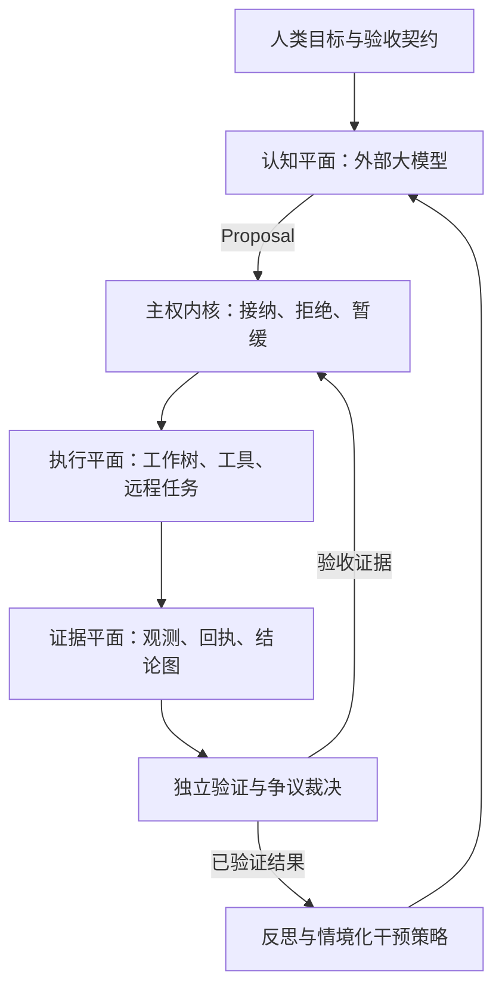

# Future-Code

[English](README.md)

Future-Code 面向长期软件研发与科研任务，通过外部 LLM API 提供认知能力，
由运行内核管理执行权限、持久状态、资源与恢复，由独立检查决定任务是否完成。

**模型提出，证据裁决，Future-Code 执行与治理。**

## 架构



| 边界 | 职责 | 实现 |
|---|---|---|
| 认知 | 理解目标、拆解任务、生成代码、提出假设与恢复方案 | `swarm/model.ts`、`swarm/recovery.ts` |
| 权限 | Proposal 接纳、冻结契约、DAG、作用域、预算、租约与恢复 | `src/harness/foundry/` |
| 证据 | 追加式观测、内容寻址工件、可撤回结论、冲突与独立裁决 | `store.ts`、`evidenceFabric.ts`、`claims.ts`、`adjudication.ts` |
| 学习 | 根据执行证据反思，按故障情境检索干预效果并推荐策略 | `rndReflection.ts`、`interventionMemory.ts`、`contextualPolicy.ts` |

模型的回答不能直接把任务标记为 PASS、扩大权限、替换验证器或删除历史。
调度、约束检查与资源优化由系统负责。历史策略推荐仍须经过当前任务的权限和验收检查。

## 能力

- 持久化 DAG、受限子任务裂变、租约 fencing 与崩溃恢复。
- 独立工作树、作用域约束、固定验证器、最终集成检查与可恢复会话。
- 远程计算任务的稳定身份、结果核对与跨恢复轮次的累计预算。
- 内容寻址工件、不可覆盖的事件与证据记录。
- 结论版本、撤回、依赖失效传播、显式冲突与机器可检查的裁决。
- 根据当前环境与故障特征推荐恢复策略，保留样本数、不确定性与弃权结果。
- 真实项目成对实验，分别记录质量、耗时、模型请求与可用费用数据。

上述治理边界适用于 Foundry/Swarm 入口。已有终端 CLI 与 HACT 研究代码保留各自入口。

## 快速开始

核心运行路径使用 Linux/macOS/WSL 上的 Node >=22.16、内置 SQLite 与 TypeScript
类型剥离。下列离线示例无需安装 npm 依赖或提供模型密钥，在仓库根目录运行：

```sh
node scripts/test-foundry.mjs
node --experimental-strip-types src/harness/foundry/cli.ts init --spec examples/foundry/spec.json
node --experimental-strip-types src/harness/foundry/cli.ts run --tasks examples/foundry/tasks.json --allow-exec
node --experimental-strip-types src/harness/foundry/cli.ts status
```

示例使用确定性 worker 与 checker。新契约使用新的 `--root DIR`，初始化不会覆盖既有契约。

连接外部模型时，参考 `examples/swarm/spec.json`，填写实际项目、API 地址、模型 ID、
密钥环境变量名以及独立验收检查：

```sh
node --experimental-strip-types src/harness/foundry/swarm/cli.ts init --spec YOUR_SPEC.json --allow-exec
node --experimental-strip-types src/harness/foundry/swarm/cli.ts run --tasks YOUR_TASKS.json --allow-exec
node --experimental-strip-types src/harness/foundry/swarm/cli.ts integrate --run RUN_ID --allow-exec
```

`supervise --objective ID --goal FILE --tasks FILE --allow-exec` 持续管理目标、恢复与最终验收。
`objective`、`episode`、`reflection`、`claims`、`status` 可检查已保存的状态和证据。
模型调用受外部服务的额度约束。Future-Code 不控制服务商的 KV cache、批处理或推理引擎。

## 验证与生产力

```sh
node scripts/test-correctness.mjs
node scripts/test-resilience.mjs
node scripts/test-foundry.mjs
node scripts/test-swarm.mjs
node scripts/test-commands.mjs
```

[真实项目实验指南](docs/agent-platform/REAL_PROJECT_EVALUATION.md)规定相同输入版本、
任务与质量门槛下的基线/候选对比。离线回放可验证运行边界；真实模型生产力提升需要
外部 API 实验。缺失的 token 或美元费用数据保持未知。

## 文档

| 主题 | 文档 |
|---|---|
| 架构原则与信任边界 | [主权内核](docs/agent-platform/SOVEREIGN_KERNEL.md) |
| 结论、证据、冲突与裁决 | [知识协议](docs/agent-platform/KNOWLEDGE_PROTOCOL.md) |
| 冻结契约与运行方案实验 | [Foundry](docs/agent-platform/FOUNDRY.md) |
| 外部 API 智能体与会话 | [Swarm](docs/agent-platform/SWARM.md) |
| 恢复与远程计算 | [Resilient R&D](docs/agent-platform/RESILIENT_RND.md) |
| API 冷却、恢复探测与传输超时 | [外部 API 恢复](docs/agent-platform/PROVIDER_RECOVERY.md) |
| 证据与资源分配 | [Evidence Fabric](docs/agent-platform/EVIDENCE_FABRIC.md) |
| 基于证据的反思 | [R&D reflection](docs/agent-platform/RND_REFLECTION.md) |
| 执行耗时、上下文退役与资源唤醒 | [Execution productivity](docs/agent-platform/EXECUTION_PRODUCTIVITY.md) |
| 干预效果与策略学习 | [Intervention memory](docs/agent-platform/INTERVENTION_MEMORY.md) |
| 回归检查与真实源码实验 | [验证记录](docs/agent-platform/SOVEREIGN_VALIDATION.md) |
| 完整终端 CLI 安装 | [Linux 部署](DEPLOY-LINUX.md)、[上手指南](ONBOARDING.md) |

## 目录

| 路径 | 内容 |
|---|---|
| `src/harness/foundry/` | 治理内核与宿主 API |
| `src/harness/foundry/swarm/` | 外部模型、工具、工作树与目标监督 |
| `tests/`、`scripts/` | 回归检查与评测工具 |
| `examples/` | 离线示例与配置 |
| `docs/agent-platform/` | 系统契约与操作文档 |
| `src/` 中其他部分 | 已有终端 CLI 与集成 |
| `paper/`、`hact-paper/` | 论文与研究实验 |

[源码来源说明](docs/SOURCE_PROVENANCE.md)记录导入源码的边界。
保留已有源码声明；文档修改不赋予源码所有权或仓库整体授权。
