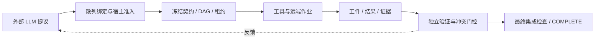
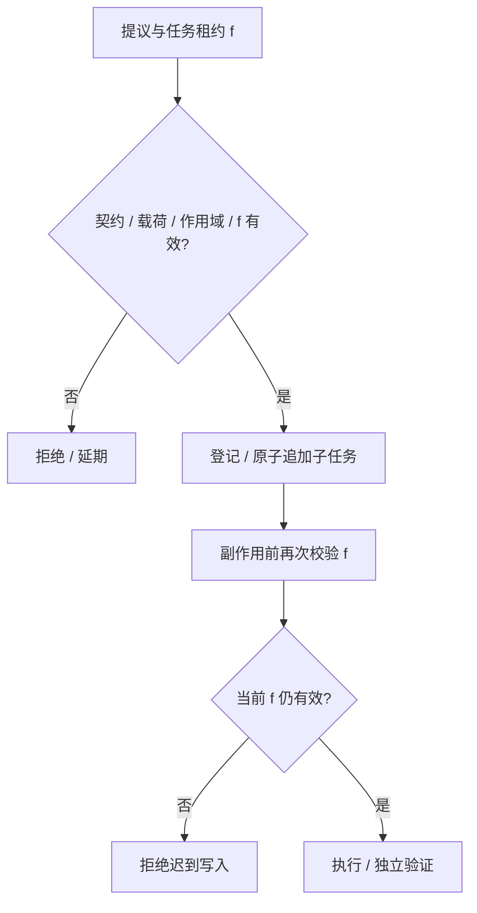

发明专利技术交底书  
**一种面向长期研发任务的证据驱动、自恢复且可自适应编排的智能体执行方法、系统、电子设备及存储介质**  
编制日期：2026-10-09

# 发明名称
一种面向长期研发任务的证据驱动、自恢复且可自适应编排的智能体执行方法、系统、电子设备及存储介质。

英文名称：Evidence-Driven, Recoverable and Adaptive Agent Execution for Long-Horizon Research and Development Tasks。

# 申请人信息
| 字段 | 内容 |
|---|---|
| 申请人名称 | 待权属审查后确认；不得直接沿用示例附件的申请人 |
| 申请人类型、注册地、统一社会信用代码 | 待确认 |
| 通讯地址、邮编、电话、电子邮箱 | 待确认 |
| 权属备注 | 需结合雇佣关系、项目来源、开源代码来源及实际发明贡献核实职务发明及申请权 |

# 发明人信息
## 第一发明人及其他发明人
| 字段 | 内容 |
|---|---|
| 发明人 | 许达、王飞（按提供顺序列示；正式排名由发明人确认） |
| 第一位列示发明人 | 许达 |
| 第二位列示发明人 | 王飞 |
| 国籍、单位、职务及通讯信息 | 分别由本人确认，公开版本不填写个人联系方式 |
| 署名依据 | 以对所要求保护的实质性技术特征的创造性贡献为准；不以代码提交次数直接认定 |

# 技术领域
本发明涉及人工智能智能体运行时、软件工程自动化、分布式计算、计算机任务调度、故障恢复及验证证据管理领域，尤其涉及在外部大模型服务、并行执行者及远程计算任务存在延迟、失败或不确定返回时，以冻结目标验收契约、带代际标识的执行权限、持久外部副作用台账和独立验证证据控制长期研发任务的方法及系统。

# 背景技术
## 现有技术的局限性
已有大模型智能体编排、DAG 任务并发、持久工作流、事件重放、租约 fencing、熔断与幂等外部调用。相关专利 CN120560815A、US20250356313A1、US20260127463A1 已分别覆盖任务拆分、代理管理及动态工作流；Temporal 等产品也公开了持久执行与副作用恢复技术。因此上述单一构件不宜直接作为新颖性依据。

在长期研发流程中，故障可能跨越多层边界：模型提出的操作在执行前已失去权限；先前有效的 worker 在租约转移后迟到提交；外部训练请求已到达远端但回执丢失；多个子任务分别通过但合并树无法验证；冲突证据或未知外部作业被错误归类为完成。2026-10-08 Temporal 公开的 Pi 代理持久化方案已经描述了工具执行前记录 pending 声明、结果未知时不自动重放，故仅把“未知结果不重试”写成独立创新也存在较高风险。

## 长期任务的状态一致性与验收问题
设目标 O 的冻结验收契约为 C，执行配置为 R，候选工件为 X，可信检查器及环境标识为 V、E，任务租约代际为 f。主机应保证同一操作提议与 (O,C,R,f) 绑定，任何旧租约或被改写提议都不能生成可接受的结果；外部副作用的作业身份须跨超时保持；目标 PASS 须以 X 的检查结果及最终集成证据决定。

## 现有智能体运行时及其扩展挑战
工作流重放、幂等键与独立测试本身是成熟方法；本交底书拟保护其在“模型只提交提议—宿主准入并复核权限—持久外部作业协调—冻结目标验收”中的具体数据约束和状态门控组合。可专利性仍取决于同一技术效果是否可由现有技术显而易见地组合得到，参见配套检索报告。

# 发明内容
## 发明目的
本发明旨在提供一种可实施的长期研发智能体运行方法：允许大模型提出新任务和恢复方案，由宿主执行模块把关；保证超时、崩溃和迁移之后的执行权有效性；在未确认远程作业不存在前阻止重复提交；将任务通过、证据冲突消解和整体集成作为独立状态门控；在不改变验收语义的前提下优化证据传输及执行策略。

## 技术方案
系统由模型适配器、宿主提议准入器、持久任务图及租约调度器、远程作业协调器、可信验证器、证据存储和最终集成门控构成。宿主持有 objective_id、不可变 contract_hash、配置 recipe_hash 与任务租约，LLM 只能提出结构化建议，无权自行发布 PASS、改变检查器或对数据库执行越权写入。

### 创新点 A：结构化提议与副作用前双重权限校验
模型输出操作类型 kind 与 payload，宿主补入 run_id、task_id、fence、contract_hash、recipe_hash，以规范化载荷计算 payload_hash 与 proposal_id。首次准入时核查登记身份、载荷、范围、租约和契约，记录 ADMIT/REJECT/DEFER；执行有副作用的工具前再次从追加式记录载入并复核当前任务的 RUNNING、fence 和 deadline。此处哈希用于完整性绑定，不能代替授权来源或提供恶意宿主防护。

### 创新点 B：冻结父规格、代际租约与原子式动态裂变
父任务已准入的目标、验收和 read/write scope 不作原位变更。动态裂变在单个持久事务内核验父任务租约、request_key/request_hash、子任务 ID、祖先依赖、写范围、深度及总数量，追加 spawn_request、spawn_edge 和子任务；重放相同请求返回既有子任务，相同 key 携带不同 hash 被拒绝。任务结果只有在当前 fence 有效且独立验证通过后方可接纳。

### 创新点 C：远程作业的意图持久化与幂等确保协议
对远程训练、仿真、编译等外部作业，宿主依据 (run_id,task_id,tool_call_id,job_template) 派生稳定 key，并依据已固定的 adapter、template、input 和 base_commit 计算 input_binding。首次网络调用前在事务中写入 research_jobs(key,input_binding,status=UNKNOWN) 与 job.intent；对现有记录核验 input_binding 不变。若已有 job_id 则向适配器发送 inspect(job_id)；否则调用由适配器承诺支持的 idempotent ensure(key,input_binding)，由远端依据稳定 key **返回原作业或原子创建**。失联时仍保持 UNKNOWN 并按期限再次协调，绝不通过更换 key 来伪造新尝试。若适配器不具备可信的幂等确保/查询语义，系统必须停止自动提交并请求人工协调。该机制仅在远端履行其接口契约、台账持久化时减少重复作业，不承诺无条件 exactly-once。

### 创新点 D：共享模型 API 故障代际与不占用工作槽的等待
同一 quota_pool 对应一条持久 agent_provider_health 记录，保存 failures、epoch、retry_at。网络或可重试 HTTP 错误将资源池置于冷却状态；等待者释放执行槽并持久化唤醒时间。到期由事务性准入限制探测，只有所属 epoch 匹配的成功回应才可消除故障；旧 epoch 迟到回应不得清除新故障。认证、配置、响应格式等错误不自动视为临时故障。

### 创新点 E：多条件证据门控与合并树再验证
被接受的任务须保存工件标识和可信验证器生成的 evidence；完成门控还要检查同一目标中的 OPEN 强证据冲突、失效 claim 和尚未终结的 research_jobs。即便所有局部任务 PASS，也须按冻结配置合并工件、检查写冲突并在集成树执行检查，满足最终验收条件后方能发布 COMPLETE。模型输出和哈希相等均不能替代机器验证。

### 创新点 F：可选证据布局与恢复建议隔离
在单独的可选 HACT 证据导出路径中，stable check_id、canonical evidence 与 checker identity 属语义状态；排列及层次树仅影响展示/传输。布局代际改变时，旧票据在受支持的票据核验路径上失效；completion hyperedge 可用于离线比较候选布局。该扩展不修改 Foundry 目标完成门控，也不保证所有验证负载都受益。历史 intervention memory 只提供建议，不修改验收标准、预算或权限。F 可作为单独、进一步检索的申请主题。

# 附图说明
图1为认知提议、宿主控制及证据验证的数据流；图2为提议绑定、租约校验和动态子任务原子准入流程；图3为远端作业的 ensure/inspect 协调与目标完成门控流程。





```mermaid
flowchart TD
  I[事务中持久化 intent / stable key] --> K{本地已有 job_id?}
  K -- 是 --> Q[inspect(job_id)]
  K -- 否 --> S[idempotent ensure(key)]
  S --> U{状态 / 回执}
  Q --> U
  U -- UNKNOWN --> D[持久等待 / 继续协调]
  D --> K
  U -- 终态 --> E[记录签定结果和证据]
  E --> G{冲突和未解决作业为零且集成验证通过?}
  G -- 否 --> H[BLOCKED / NEEDS_ATTENTION]
  G -- 是 --> Y[COMPLETE]
```

# 具体实施方式
## 系统架构
参考实现使用支持唯一键及事务的 SQLite 存储。runs 表保存契约与配置散列，tasks/attempts 保存租约和结果；kernel_proposals/kernel_admissions 保存带身份绑定的操作提议与准入记录；spawn_requests/spawn_edges 使子任务裂变可去重；research_jobs 的 key 唯一且 input_hash 不可在重放时漂移；agent_provider_health/admissions/waits 持久化资源池代际与唤醒时间；fabric_conflicts、claim 状态和目标完成记录参与完成门控。任务存储或协议适配器的可信性为实施前提，Git worktree 不是针对不受信任代码的操作系统沙箱。

## 实施步骤
### 实施例1：长周期软件研发任务的接纳与验收
S101：操作员提交目标 O、固定输入提交 X0、检查器及执行权限，宿主形成契约 C 和 recipe_hash。S102：模型提出含 kind、payload 的操作，宿主补齐运行和租约信息、规范化计算提议哈希，落地追加式记录并判定 ADMIT。S103：执行工具前读取提议和最新 tasks 行，再次核查 hash、RUNNING、fence 和 deadline。S104：父任务请求裂变时核查 request_key、祖先依赖、数量和作用域，在事务中追加子任务与边。S105：租约 A 过期后交给 B，迟到的 A 因 fence 不符而被拒绝。S106：各工件通过独立验证后，在组合树运行冻结集成检查，且没有冲突、失效 claim 和未决外部作业时，写入目标 COMPLETE。

### 实施例2：不确定远端训练结果的恢复
S201：模型在经过准入后调用配置的 run_job；本地构造 key=H(run_id,task_id,call_id,template)，binding=H(adapter,template,input,base_commit)。S202：在首次向远端发送请求前插入 status=UNKNOWN 的 research_jobs 唯一键记录与 job.intent 事件。S203：如远端已返回 job_id，则请求 inspect；否则以同一 key 调用已核定的 idempotent ensure。适配器在其受控持久状态中以 key 去重，保证重复 ensure 不创建另一份物理作业。S204：若 RPC 中途断开，保留 UNKNOWN 和重试时刻，绝不以新 key 代替旧作业；若适配器返回“无法协调”，转人工核对并阻止目标完成。S205：终态回复须具有一致的 key/job_id/status；SUCCEEDED 还需 result。将 reply 及其 reconciliation receipt 持久化，随后经独立检查器完成实验验收。此例不将适配器的自报终态直接等同于科学结果有效。

### 实施例3：模型 API 故障与证据导出
S301：一次暂时性模型 API 错误使共享资源池 epoch 增加并设 retry_at，原执行槽释放。S302：旧请求晚到的成功回复因 epoch 不匹配，不能清除新周期冷却；新请求到期受控探测后方可恢复通常并发。S303：可选 HACT 导出模块为检查项建立稳定 ID，以 canonical evidence 计算验证结果，另以树布局组织证据包。S304：若布局更换使 generation 改变，旧导出票据被受信核验器拒绝，目标级 PASS 的判定仍由冻结检查器及完成门控决定。

**状态一致性与异常处理：** 租约写入不变量：仅 RUNNING 且 current_fence=proposal_fence、deadline 未过期的任务可执行受保护副作用。远端作业不变量：相同 key 始终绑定相同 input_hash；UNKNOWN 状态不得直接宣告作业不存在；重放必须复用受核定幂等 ensure/inspect 协议。完成不变量：COMPLETE ⇒ 全部必要任务有独立接受证据 ∧ 未决远端作业数=0 ∧ OPEN 冲突数=0 ∧ 失效 claim 数=0 ∧ 合并树最终检查 PASS。数据库失效、适配器失信、检查器污染、预算耗尽或用户取消均不满足无条件连续完成的假设。

# 技术效果
## 执行正确性
通过 proposal_id、contract_hash、fence 的重复核验，减少不同运行/租约间的越权或迟到状态变更；以原子裂变确保同一请求的确定性重放；将模型自述的成功与机器验收隔离。效果取决于宿主存储原子性、可信检查器及权限检查实现。

## 高性能与经济可行性
API 冷却期间释放任务执行槽，降低忙等占用；幂等 ensure 和稳定作业身份能够在兼容远端适配器的前提下减少重复训练/仿真开销；独立任务可并行。上述收益随故障率、作业长度、任务图并行宽度和验证成本变化，本交底书不主张固定加速倍数或优于其他代理框架的通用性能结论。

## 系统健壮性
数据库记录 UNKNOWN、重放身份、故障 epoch 和未解决证据，遇不可判断的远端副作用时阻断目标验收而非盲目重投。自动恢复不能突破权限、目标总预算、人工停止或长期不可用的外部服务。候选负测包括：旧租约提交被拒、相同 key 不同 input_hash 被拒、重复 ensure 返回同一 job_id、未知作业不生成 COMPLETE、局部 PASS 而合并检查失败时拒绝 COMPLETE。

# 权利要求书
## 独立权利要求
**权利要求1：** 一种面向长期研发任务的智能体执行及完成状态控制方法，其特征在于，由计算机宿主执行以下步骤：

（1）将目标标识、不可变验收契约、检查器配置和执行配置固化为可持久读取的版本绑定记录；

（2）接收大模型的结构化操作提议，由所述宿主将该提议与运行、任务、租约代际、契约及载荷散列绑定并记录准入结果，在实际执行具有副作用的工具操作前，重新核验所述绑定和当前租约状态；

（3）在调用具备幂等确保能力的远端计算适配器前，以运行、任务和工具调用身份派生稳定作业键，持久化该作业键、输入绑定和未知提交状态；恢复时以所述作业键调用幂等确保接口，或在已知远端作业号时调用状态查询接口，使重复调用复用同一逻辑作业，且未终结状态保留为未解决外部作业；

（4）将候选工件与独立检查器输出的可追溯验证证据关联，在必要任务没有已接受证据、存在未解决外部作业或冲突时禁止目标完成；

（5）在多个候选工件组合后执行与所述冻结验收契约绑定的最终集成检查，仅在检查通过并且不存在所述阻断条件时持久发布目标完成状态。

**权利要求2：** 一种智能体执行系统，包含模型提议适配器、宿主准入模块、任务租约模块、外部作业协调模块、验证证据模块及集成验收模块，其协同执行权利要求1所述方法。

**权利要求3：** 一种电子设备，包括处理器和存储器，存储的指令由处理器执行时实现权利要求1所述方法。

## 从属权利要求
**权利要求4：** 根据权利要求1所述方法，其中宿主使用规范化载荷计算提议身份，将提议历史和准入结果以不可变记录保存，并在既有准入被复用时重新核验提议内容与当前租约代际。

**权利要求5：** 根据权利要求1所述方法，其中对已准入父任务仅以追加关系登记动态子任务，并在同一事务中验证 request_key、request_hash、父租约、子任务深度、数量、依赖与作用域；相同请求身份但载荷不同的重放被拒绝。

**权利要求6：** 根据权利要求1所述方法，其中所述稳定作业键通过运行标识、任务标识、工具调用标识和作业模板标识的散列生成，输入绑定通过固定适配器、模板、输入和基准提交生成，远端适配器以该键对确保请求作去重处理。

**权利要求7：** 根据权利要求6所述方法，其中当远端适配器无法提供幂等确保/查询保证或任务结果身份不一致时，将作业标记为待协调状态，暂停自动重投并阻止目标完成。

**权利要求8：** 根据权利要求1所述方法，其中宿主完成门控同时要求全部必要任务的工件和验证证据有效、没有 OPEN 强证据冲突、没有待协调远端作业、没有失效 claim 且最终集成检查通过。

**权利要求9：** 根据权利要求8所述方法，其中相互矛盾的强证据产生冲突记录，宿主生成需独立机器检查的反例、差分测试或判别实验提议，并要求其重新经过权限准入。

**权利要求10：** 根据权利要求1所述方法，其中同一模型资源池存储故障 epoch 与 retry_at，在冷却期间释放工作槽，只允许当前 epoch 的受控成功探测恢复准入，迟到的旧 epoch 成功结果不清除当前故障。

**权利要求11：** 根据权利要求8所述方法，其中可选证据导出结构把稳定检查身份及规范证据与层次布局分离，布局迁移时增加代际值并拒绝旧代际导出票据；所述布局不能改变冻结验收语义。

**权利要求12：** 根据权利要求11所述方法，其中以同一更新阶段共同完成的检查项形成 completion hyperedge，并在独立验证样本上以完整集合的层次更新成本决定是否替换原布局。

**权利要求13：** 一种非暂态计算机可读存储介质，存有使计算机实现权利要求1所述方法的程序指令。

# 说明书摘要
本发明公开一种面向长期研发任务的智能体执行及完成状态控制方法、系统、电子设备和存储介质。宿主将模型操作提议与冻结验收契约、任务租约代际和载荷散列绑定，并在副作用执行前再次验证授权；针对远端训练、仿真任务，先持久化稳定作业身份和未知提交状态，再通过幂等确保或状态查询接口协调恢复；对候选工件建立独立验证证据，在未决作业、冲突或最终集成验证失败时阻断目标完成。方案用于降低长周期研发流程的迟到写入、重复作业及局部验收误判风险。
