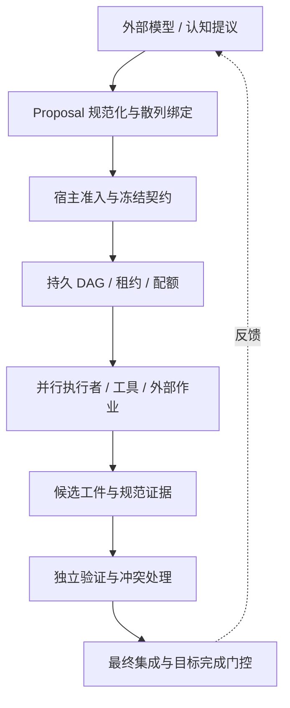
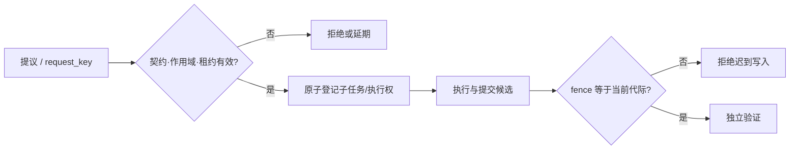
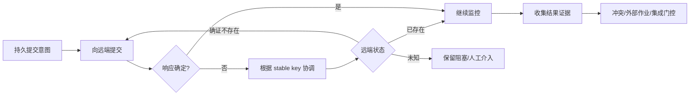

发明专利技术交底书  
**一种面向长期研发任务的证据驱动、自恢复且可自适应编排的智能体执行方法、系统、电子设备及存储介质**  
编制日期：2026-10-09

# 发明名称
一种面向长期研发任务的证据驱动、自恢复且可自适应编排的智能体执行方法、系统、电子设备及存储介质。

英文名称：Evidence-Driven, Recoverable and Adaptive Agent Execution for Long-Horizon Research and Development Tasks。

# 申请人信息
| 字段 | 内容 |
|---|---|
| 申请人名称 | 待权属审查后确认；不得直接沿用示例附件的申请人 |
| 申请人类型、注册地、统一社会信用代码 | 待确认 |
| 通讯地址、邮编、电话、电子邮箱 | 待确认 |
| 权属备注 | 需结合雇佣关系、项目来源、开源代码来源及实际发明贡献核实职务发明及申请权 |

# 发明人信息
## 第一发明人
| 字段 | 内容 |
|---|---|
| 姓名及顺序 | 待根据实际创造性贡献确认；不得直接沿用示例姓名 |
| 国籍、工作单位、职务/职称 | 待确认 |
| 联系方式 | 待确认 |

# 技术领域
本发明涉及人工智能智能体运行时、软件工程自动化、分布式计算、计算机任务调度、故障恢复及验证证据管理领域，尤其涉及在外部大模型服务、并行执行者及远程计算任务存在延迟、失败或不确定返回时，以冻结目标验收契约、带代际标识的执行权限、持久外部副作用台账和独立验证证据控制长期研发任务的方法及系统。

# 背景技术
## 现有技术的局限性
现有智能体框架能够根据模型输出分解任务、调用工具并保存会话。已有有向无环图（DAG）任务编排、多智能体协作、工作流检查点、失败重试、内容寻址缓存等方案；这些技术本身不能作为本发明的新颖性基础。对于跨多次进程、模型请求、代码版本和远程计算的长期研发目标，仅保存对话或任务节点状态仍可能不能证明目标已正确实现。

在典型故障中：（1）执行者租约已过期但迟到结果仍尝试写入；（2）模型在恢复时改变既定的验收条件；（3）网络超时使远程作业处于“已提交但本地未知”；（4）各子任务分别通过却无法集成；（5）相互冲突的验证证据被模型摘要掩盖；（6）API 故障使工作线程持续阻塞并耗尽调度容量。

## 长期任务的状态一致性与验收问题
设目标为 O，冻结验收契约为 C，当前候选代码或实验对象为 X，验证器身份为 V、环境身份为 E、运行代际为 g。目标通过状态不能仅由模型的文字回答确定，而须由对应 (O,C,X,V,E,g) 的可核查证据及最终集成验证共同决定。由于执行者、任务树、提供商请求和远程作业在不同故障域运行，系统还需要保证：旧租约不能越权写入；相同裂变请求在重放时不会重复创建不同子任务；不确定远程副作用不得盲目重试。

## 现有智能体运行时及其扩展挑战
基于检查点的智能体框架可恢复图状态，持久工作流引擎可重放事件并管理重试；已公开专利亦涉及 LLM 任务拆解、DAG 编排、动态调整和多智能体管理。因此，本发明的着重点为一组受同一冻结验收契约约束、且跨认知提议、租约、外部副作用与验证证据保持绑定的状态转换，特别是长时研发作业的不确定副作用与最终验收之间的闭环。不同组件能否构成有创造性的技术组合，须以检索报告和代理人审查为准。

# 发明内容
## 发明目的
本发明旨在提供一种可实施的长期研发智能体运行方法：允许大模型提出新任务和恢复方案，由宿主执行模块把关；保证超时、崩溃和迁移之后的执行权有效性；在未确认远程作业不存在前阻止重复提交；将任务通过、证据冲突消解和整体集成作为独立状态门控；在不改变验收语义的前提下优化证据传输及执行策略。

## 技术方案
系统包括认知提议单元、持久任务图与授权单元、执行租约与调度单元、模型服务恢复单元、远程作业协调单元、证据管理与独立验证单元及目标集成单元。目标标识 objective_id 与契约散列 contract_hash 在目标生命周期内保持不变；外部 LLM 以结构化提议输入系统，不直接持有状态库的可写凭据或目标 PASS 权限。

### 创新点 A：提议—准入—执行三步绑定机制
模型生成的提议至少包括 kind、payload；宿主补入 run_id、task_id、fence、contract_hash、recipe_hash，并对规范化载荷计算 payload_hash 和 proposal_id。将提议写入追加式记录后，宿主依据执行范围、受保护路径、租约有效期及冻结契约输出 ADMIT/REJECT/DEFER；真正发生工具副作用之前再次复核原记录与当前租约。对内容更改、跨运行复用或过期租约一律拒绝。这种两次绑定校验避免把模型自身的说明文本当作可执行授权。

### 创新点 B：不可变任务规格与代际隔离的动态任务裂变
父任务经准入后其验收标准、依赖和读写范围不原位改写。新子任务经稳定 request_key/request_hash 去重，追加至 spawn_edges；在同一事务中校验父任务 RUNNING 状态、fence、深度、数量、依赖及作用域，并完成子任务登记。Worker 持有 (task_id,owner,fence,deadline)；撤销/超期后改变 fence，使迟到结果不能更新当前任务。子任务完成只能提供局部证据，不能跳过最终集成门控。

### 创新点 C：远程副作用的意图先行与协调优先恢复
针对训练、仿真或远程编译，在提交前持久化 (objective_id,logical_job_key,adapter_id,template_hash,payload_hash,submission_intent)。远端返回作业号及状态后记录在同一作业台账；若提交期间断连，状态标记 UNKNOWN。恢复时优先以稳定键请求远端查询/协调，确认 RUNNING 或 SUCCEEDED 时直接接续监控与验收；无法确认不存在时保持阻塞并要求人工/外部证据，只有具备“未发生”可信结果时才允许再次提交。该过程限制重复计算及难以撤销的副作用，但不宣称在缺少远端幂等接口时可实现物理上的 exactly-once。

### 创新点 D：共享模型服务故障代际与非阻塞等待
对同一 quota_pool 维护 HEALTHY、OPEN、HALF_OPEN、outage_epoch、retry_at 及失败次数。临时错误触发 OPEN 并持久化等待；调度器释放执行槽而不是让任务占用线程睡眠；到期时仅允许受控探测；探测成功方可恢复通常并发，旧 epoch 的迟到成功不得清除后续故障。认证、配置和无效响应等非临时错误仍显式报错，目标预算和人工取消不能由自动恢复绕过。

### 创新点 E：候选身份绑定的验证证据与目标级完成门控
独立验证器将 candidate_hash、checker_hash、environment_hash、contract_hash 与 PASS/FAIL/UNKNOWN 证据绑定存储。强证据互相矛盾时记录 OPEN conflict，生成需机器可判断反例/差分测试的裁决候选，仍须经过准入。目标通过条件至少包含：全部必要任务存在已接受工件及验证证据、未解决外部副作用为零、未裁决冲突为零、证据没有失效，以及按冻结规则重新集成后的综合检查通过。单个 Agent 的“完成”陈述不能替代上述门控。

### 创新点 F：语义证据与布局分离及受约束的策略优化
在可选实施中，语义层保存稳定 check_id、最新规范证据、版本和有效性；布局层仅安排 ID 的排列与聚合树（HACT），布局变更提升 layout_generation，拒绝旧代际发布票据。根据共同完成的检查集合（completion hyperedge）评估验证证据布局候选，效果不优于当前布局则不迁移。恢复策略的历史改进统计仅为建议，任何调整不得改变冻结验收契约、验证器和权限边界；因此传输布局或策略变化不会自动改变“通过”的定义。

# 附图说明
图1为认知平面、主权控制平面及证据平面组成的总体结构；图2为绑定提议、动态裂变、代际租约和重放抑制的控制流程；图3为远程作业不确定结果协调及目标级证据验收的流程。

# 具体实施方式
## 系统架构
实施时，宿主运行 SQLite 或其他支持事务、唯一约束与持久日志的数据存储：runs 表绑定契约和执行配置；tasks/attempts/spawn_edges 记录任务图及执行者代际；kernel_proposals/kernel_admissions 保存提议及准入决定；provider_circuits 保存服务故障周期；research_jobs 保存远程作业及其外部结果；fabric_evidence/fabric_conflicts 保存验证与冲突；目标完成表保存最终集成证明的摘要。模块间采用带散列的结构化消息，模型适配器仅能请求宿主接口。代码仓库的参考实现主要位于 `src/harness/foundry/`、`src/harness/foundry/swarm/` 和 `src/hact/`，涉及上述技术特征的组合仍须依据实际部署版本确认。

## 实施步骤
### 实施例 1：多子任务软件研发
步骤 S101：用户提交目标、原始仓库提交、允许写入路径、预算及命名检查器，宿主冻结验收契约并计算 contract_hash。步骤 S102：模型提交接口、实现与测试子任务的提议，宿主进行作用域和依赖校验后生成 DAG。步骤 S103：执行者获得具有 fence 的租约，在隔离工作树中修改文件；一个任务动态提出新子任务时，宿主以 request_key 事务性去重并登记 spawn edge。步骤 S104：执行者 A 超时后重新分配给 B；即使 A 恢复，A 的旧 fence 结果也不可写入。步骤 S105：验证器以冻结命令验证每个候选，集成单元在组合树重新检查，通过方可发布 COMPLETE；若冲突则继续处理，不以局部 PASS 替代目标 PASS。

### 实施例 2：远程科研训练与 API 中断
步骤 S201：在发出远程训练指令前，将 logical_job_key、参数散列与 adapter 身份写入台账。步骤 S202：请求发送后网络断开，系统将作业标为 UNKNOWN 并释放等待执行槽。步骤 S203：重启后首先以原稳定键查询；若远端返回 RUNNING，则只跟踪原作业；若查询仍不确定，不重新发起昂贵训练。步骤 S204：模型 API 连续短暂失败时，quota_pool 进入 OPEN，持久化 retry_at 并仅在 HALF_OPEN 允许受控探测。步骤 S205：训练结果落盘后由冻结检查器处理实验指标，失败的实验保留真实 FAIL 及其成本，不向模型伪造有效进展。

### 实施例 3：证据布局切换与验收保持
步骤 S301：为每个检查项分配稳定 check_id，生成规范证据及其候选和检查器绑定。步骤 S302：统计先前共同完成的检查集合，以完整集合的层次更新成本比较多种 HACT 布局。步骤 S303：仅在验证样本上达到预设成本条件时更改布局并提升 generation。步骤 S304：旧 generation 的证据展示票据被拒绝，新的布局仍从语义层读取 PASS/FAIL/UNKNOWN。步骤 S305：系统对冲突建立 OPEN 记录，要求新判别检查通过且最终集成成功，才完成目标。该例提供数据结构与控制关系，不把模拟成本收益当作生产环境实测速度提升。

# 技术效果
## 执行正确性
在宿主状态存储及其事务、检查器和远端适配器符合假设时，可阻止旧租约写入已转移任务；保持父任务验收规格与运行时裂变分离；拒绝未获授权的模型提议；避免把单个任务通过或自然语言结论误判为整体验收完成。该效果通过状态机和不变量实现，而非依赖大模型判断准确率。

## 高性能与经济可行性
针对长期运行，可释放暂不可用模型 API 的本地执行槽，并在远端作业状态不确定时降低重复提交概率；适当的并行 DAG 可减少可并行部分的墙钟时间；HACT 仅可能减少某些检查更新分布下的证据传输或重验开销。收益依赖并行宽度、远端接口、故障频率及证据更新分布，不能推定固定倍数。仓库提供离线回放和单元回归结果，但尚不足以证明相对 Claude/Codex 的通用实测生产率提升。

## 系统健壮性
持续监督可依据冻结预算重试或重规划，保留审计记录与未解决外部作业状态；超限、凭据缺失、不可恢复错误或人工取消须明确停止或进入 NEEDS_ATTENTION。此方案不能保证在外部服务永久不可用、任务不可解或宿主存储被恶意篡改时必然完成。

# 权利要求书
## 独立权利要求
**权利要求1：** 一种面向长期研发任务的智能体执行方法，其特征在于，包含：

（1）持久化目标标识、不可变验收契约和经散列绑定的执行配置；

（2）接收模型提出的结构化操作提议，由宿主为所述提议绑定运行标识、任务标识、执行租约代际、验收契约散列和载荷散列，记录准入判定，并在执行具有副作用的操作前复核所述绑定；

（3）依据任务依赖图调度执行者，对执行者分配含代际信息的租约；运行时子任务在不修改已准入父任务规格的前提下，经稳定请求身份去重及范围校验后追加；

（4）对于远端计算作业，在实际提交前持久化逻辑作业身份和提交意图，当提交结果不确定时先依据所述身份协调远端状态，在无法确认先前操作未发生时阻止重新提交；

（5）将执行工件与由独立检查器生成的验证结果绑定到候选版本、验收契约、检查器和环境身份，并在未解决证据冲突或未解决外部作业存在时阻止目标完成；

（6）对多个已通过任务的工件重新集成并运行冻结的最终验收检查，仅在其结果符合所述验收契约时持久记录目标完成状态。

**权利要求2：** 一种智能体执行系统，包括模型适配模块、宿主提议准入模块、持久化任务图与租约调度模块、外部作业协调模块、验证证据管理模块和最终集成模块，各模块配置为执行权利要求1所述的方法。

**权利要求3：** 一种电子设备，包括处理器和存储器，所述存储器中的指令被处理器执行时实现权利要求1所述的方法。

## 从属权利要求
**权利要求4：** 根据权利要求1所述的方法，其中提议历史及准入历史以追加记录方式保存，使用规范化载荷散列校验被复用提议的完整性，且在旧租约已失效时重新拒绝既有准入提议。

**权利要求5：** 根据权利要求1所述的方法，其中动态任务裂变事务同时校验父任务 lease generation、请求身份、子任务深度、数量、依赖视图和写入范围，并将裂变关系保存在追加式 spawn_edges 中。

**权利要求6：** 根据权利要求1所述的方法，其中对同一模型服务资源池持久化 HEALTHY、OPEN、HALF_OPEN 状态和 outage_epoch，在 OPEN 时释放执行槽，且旧故障周期的迟到回复不使当前故障周期关闭。

**权利要求7：** 根据权利要求1所述的方法，其中远程作业协议具有稳定 logical_job_key、提交意图记录、UNKNOWN 状态和 reconciliation 查询，未能证明先前副作用不存在时将作业保持为待处理状态。

**权利要求8：** 根据权利要求1所述的方法，其中目标完成门控同时要求各任务具有接受工件及验证证据、没有 OPEN 的强证据冲突、没有未解决外部作业并通过最终集成检查。

**权利要求9：** 根据权利要求8所述的方法，其中相互矛盾的验证证据生成待裁决冲突，裁决任务需产生最小反例、差分测试或判别实验之一的机器可检查结果，并重新接受准入判定。

**权利要求10：** 根据权利要求8所述的方法，其中规范检查证据的语义身份与层次布局分离，布局切换提升 generation，旧代际证据发布票据不可用于当前目标完成判定。

**权利要求11：** 根据权利要求10所述的方法，其中依据共同完成的检查项形成 completion hyperedge，在独立验证样本上比较完整 hyperedge 更新成本，并在候选布局不优于现用布局时保持现用布局。

**权利要求12：** 根据权利要求1所述的方法，其中依据历史已验证任务结果选择重规划建议，但不允许模型或干预策略更改冻结检查器、验收标准、执行权限或目标累计预算。

**权利要求13：** 一种非暂态计算机可读存储介质，其上存储有使处理器执行权利要求1所述方法的计算机程序。

# 说明书摘要
本发明公开了一种面向长期研发任务的智能体执行方法、系统、电子设备及存储介质。系统将模型生成的操作提议与宿主控制的运行、任务租约代际和冻结验收契约绑定；对动态子任务采用不可变父任务规格和持久追加式依赖关系；对远程训练或仿真任务采用提交意图持久化及不确定结果协调优先机制；对候选工件采用独立验证、冲突阻断和最终集成门控，仅在证据满足目标契约时发布完成状态。可选地，系统以故障代际实现模型服务非阻塞恢复，并将检查语义证据与自适应层次布局分离。该方法有助于降低长时研发任务因迟到写入、重复外部作业和局部验收误判产生的系统风险。
